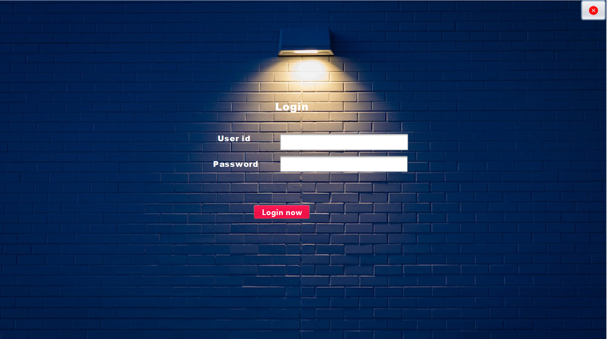
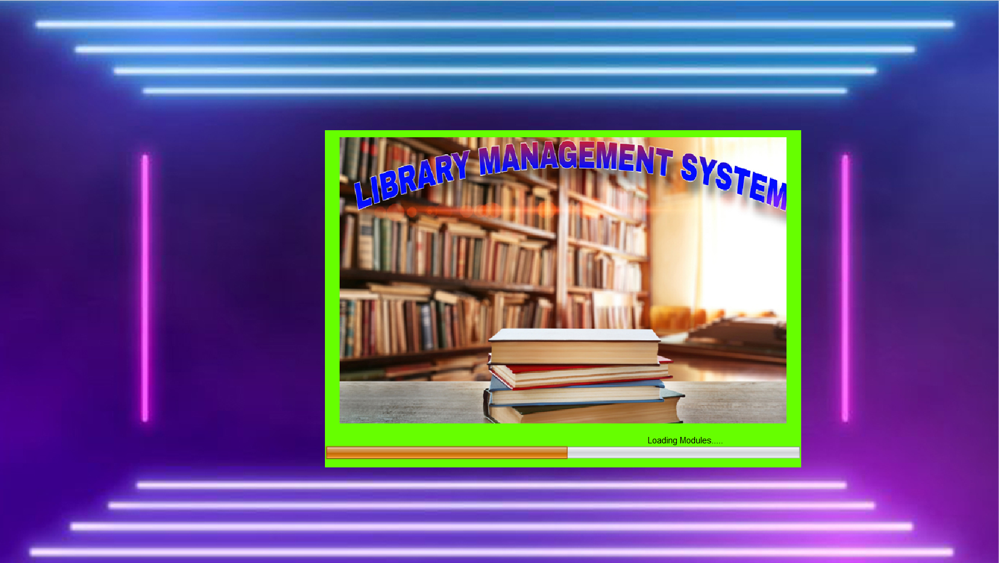
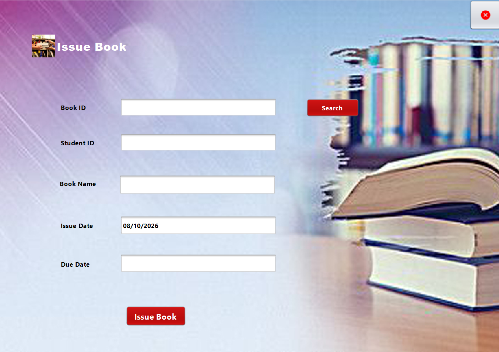
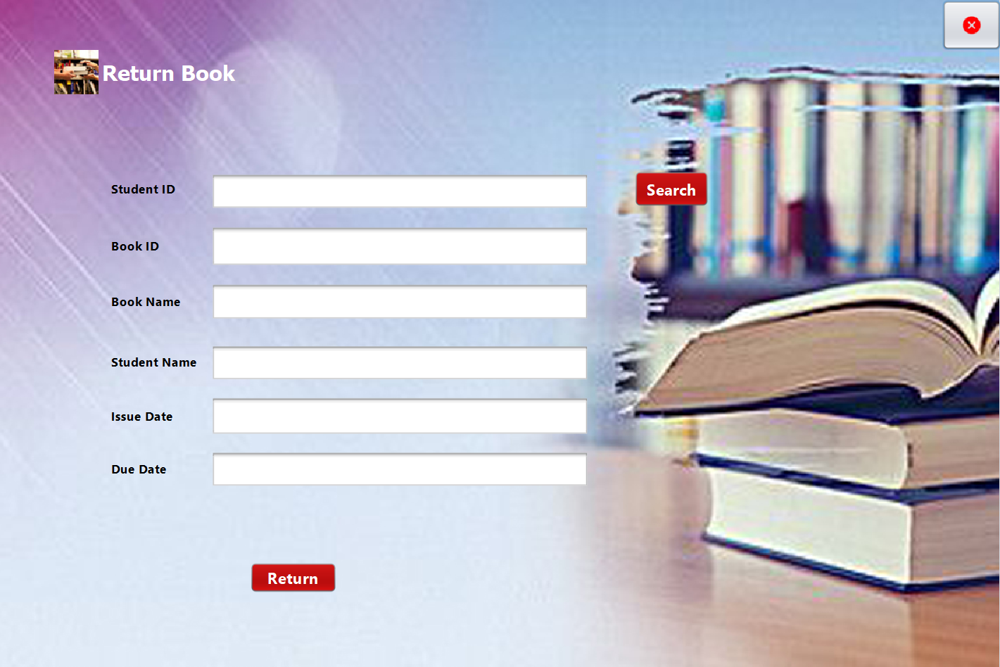
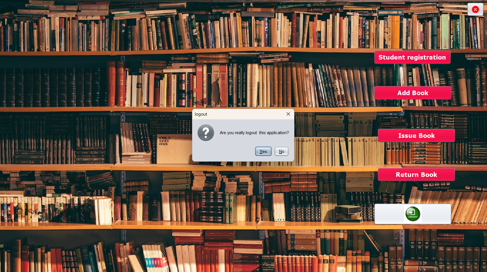
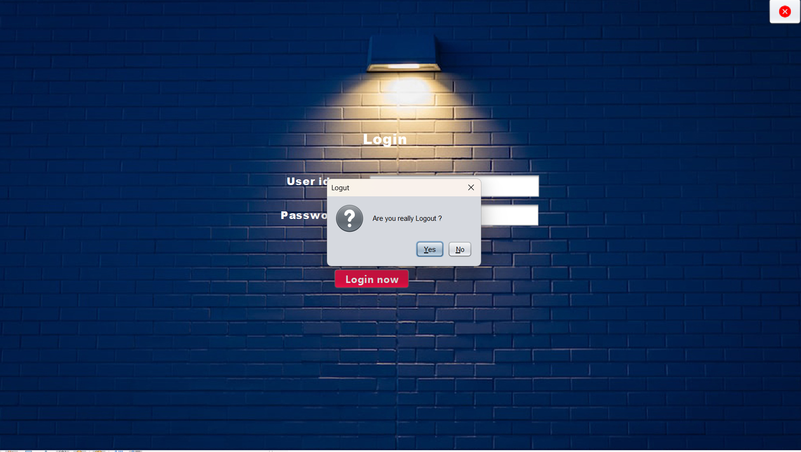

# Cognevance_library_management_system

Java Swing based Library Management System using MySQL

---

## Run Project

### Application Screenshots

The following screenshots demonstrate the major features of the Library Management System.

### Login



### Home



### Add Book


### Student Registration


### Issue Book


### Return Book



### Book Management



### Database



### Logout



---

## Project Structure

```text
library_management_system/
├── database/
│   └── library.sql
├── docs/
│   └── PROJECT_DOCUMENTATION.md
├── screenshots/
│   ├── login.png
│   ├── home.png
│   ├── add-book.png
│   ├── student-registration.png
│   ├── issue-book.png
│   ├── return-book.png
│   ├── book-management.png
│   ├── database.png
│   └── logout.png
├── src/
├── build.xml
├── manifest.mf
└── README.md